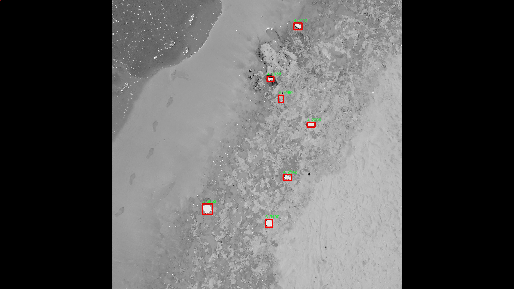

# 海滩垃圾检测系统源码分享
 # [一条龙教学YOLOV8标注好的数据集一键训练_70+全套改进创新点发刊_Web前端展示]

### 1.研究背景与意义

项目参考[AAAI Association for the Advancement of Artificial Intelligence](https://gitee.com/qunmasj/projects)

项目来源[AACV Association for the Advancement of Computer Vision](https://kdocs.cn/l/cszuIiCKVNis)

研究背景与意义

随着全球经济的快速发展和城市化进程的加快，海洋环境的污染问题日益严重，尤其是海滩垃圾的增多，不仅影响了海洋生态系统的健康，也对人类的生活质量和旅游业造成了负面影响。海滩作为人们休闲和旅游的重要场所，其环境卫生的维护显得尤为重要。近年来，随着深度学习技术的飞速发展，基于计算机视觉的物体检测方法在垃圾监测与分类中展现出了良好的应用前景。YOLO（You Only Look Once）系列模型因其高效的实时检测能力而被广泛应用于各种物体检测任务中，尤其是在复杂环境下的应用。

本研究旨在基于改进的YOLOv8模型，构建一个高效的海滩垃圾检测系统。该系统将利用“Beach 01”数据集，该数据集包含3700张图像，涵盖了6个不同类别的垃圾物体。这些类别的划分不仅有助于提高垃圾检测的准确性，也为后续的垃圾分类和处理提供了基础数据支持。通过对该数据集的深入分析和处理，我们可以更好地理解海滩垃圾的分布特征和种类特征，从而为海滩环境的保护和治理提供科学依据。

在海滩垃圾检测中，传统的人工巡查方法不仅耗时耗力，而且容易受到主观因素的影响，检测效率低下。基于YOLOv8的自动化检测系统能够实时处理海滩图像，快速识别和定位不同类别的垃圾，极大地提高了检测的效率和准确性。此外，改进的YOLOv8模型通过优化网络结构和算法参数，能够在保证检测精度的同时，提升模型的运行速度，适应实时监测的需求。

本研究的意义不仅在于技术层面的创新，更在于其对海洋环境保护的实际贡献。通过建立高效的海滩垃圾检测系统，我们可以及时发现和清理海滩上的垃圾，减少其对海洋生态的影响，促进海洋资源的可持续利用。同时，该系统的成功应用还将为其他环境监测领域提供借鉴，推动计算机视觉技术在环境保护中的广泛应用。

综上所述，基于改进YOLOv8的海滩垃圾检测系统的研究，不仅具有重要的学术价值，也具备显著的社会意义。通过科学的垃圾检测与管理，我们能够为保护海洋环境、维护生态平衡做出积极贡献，促进人类与自然的和谐共生。

### 2.图片演示


##### 注意：由于此博客编辑较早，上面“2.图片演示”和“3.视频演示”展示的系统图片或者视频可能为老版本，新版本在老版本的基础上升级如下：（实际效果以升级的新版本为准）

  （1）适配了YOLOV8的“目标检测”模型和“实例分割”模型，通过加载相应的权重（.pt）文件即可自适应加载模型。

  （2）支持“图片识别”、“视频识别”、“摄像头实时识别”三种识别模式。

  （3）支持“图片识别”、“视频识别”、“摄像头实时识别”三种识别结果保存导出，解决手动导出（容易卡顿出现爆内存）存在的问题，识别完自动保存结果并导出到tempDir中。

  （4）支持Web前端系统中的标题、背景图等自定义修改，后面提供修改教程。

  另外本项目提供训练的数据集和训练教程,暂不提供权重文件（best.pt）,需要您按照教程进行训练后实现图片演示和Web前端界面演示的效果。

### 3.视频演示

[3.1 视频演示](https://www.bilibili.com/video/BV1do1yYrECm/)

### 4.数据集信息展示

##### 4.1 本项目数据集详细数据（类别数＆类别名）

nc: 6
names: ['0', '1', '2', '3', '4', '5']


##### 4.2 本项目数据集信息介绍

数据集信息展示

在本研究中，我们采用了名为“Beach 01”的数据集，以支持对海滩垃圾检测系统的改进，特别是针对YOLOv8模型的训练与优化。该数据集专注于海滩环境中的垃圾识别，具有重要的实际应用价值，旨在提高海洋生态保护和环境清洁的效率。通过对该数据集的深入分析，我们可以更好地理解其结构、内容及其在训练过程中的作用。

“Beach 01”数据集包含六个类别的垃圾物品，分别用数字“0”到“5”进行标识。这些类别的设置反映了海滩上常见的垃圾类型，涵盖了多种材质和形态，能够有效地模拟实际环境中的垃圾分布情况。具体而言，这些类别可能包括塑料瓶、食品包装、烟蒂、玻璃碎片、纸张和其他杂物等。这种多样性不仅丰富了数据集的内容，也为模型的训练提供了广泛的样本，有助于提高其在不同情况下的识别能力。

在数据集的构建过程中，研究团队通过实地考察和拍摄，收集了大量的海滩垃圾图像。这些图像经过精心标注，确保每个类别的垃圾在图像中都得到了准确的识别和定位。这种高质量的标注是训练深度学习模型的基础，能够有效提升模型的学习效果和识别精度。此外，数据集中的图像还涵盖了不同的光照条件、天气变化和视角差异，增强了模型的鲁棒性，使其能够在多变的环境中保持良好的性能。

在训练YOLOv8模型时，数据集的多样性和丰富性将直接影响模型的泛化能力。通过对“Beach 01”数据集的训练，模型能够学习到各类垃圾的特征，包括形状、颜色、纹理等，从而在实际应用中实现高效的垃圾检测与分类。这对于海滩清理工作具有重要意义，能够帮助清洁人员快速识别和处理垃圾，减少对海洋生态的影响。

值得注意的是，数据集的类别数量和类别名称的设计也反映了对垃圾分类的重视。随着环保意识的提升，海洋垃圾的分类管理逐渐成为研究的热点。通过将垃圾细分为多个类别，研究人员不仅能够提高检测的准确性，还能够为后续的垃圾处理和回收提供数据支持。这种细致的分类方法，有助于推动海洋垃圾治理的科学化和系统化。

总之，“Beach 01”数据集为改进YOLOv8的海滩垃圾检测系统提供了坚实的基础。通过对该数据集的深入分析与应用，我们期待能够在海洋环保领域取得更大的进展，推动相关技术的发展与应用，为保护海洋生态环境贡献一份力量。





### 5.全套项目环境部署视频教程（零基础手把手教学）

[5.1 环境部署教程链接（零基础手把手教学）](https://www.ixigua.com/7404473917358506534?logTag=c807d0cbc21c0ef59de5)


[5.2 安装Python虚拟环境创建和依赖库安装视频教程链接（零基础手把手教学）](https://www.ixigua.com/7404474678003106304?logTag=1f1041108cd1f708b01a)

### 6.手把手YOLOV8训练视频教程（零基础小白有手就能学会）

[6.1 手把手YOLOV8训练视频教程（零基础小白有手就能学会）](https://www.ixigua.com/7404477157818401292?logTag=d31a2dfd1983c9668658)


按照上面的训练视频教程链接加载项目提供的数据集，运行train.py即可开始训练



     Epoch   gpu_mem       box       obj       cls    labels  img_size
     1/200     20.8G   0.01576   0.01955  0.007536        22      1280: 100%|██████████| 849/849 [14:42<00:00,  1.04s/it]
               Class     Images     Labels          P          R     mAP@.5 mAP@.5:.95: 100%|██████████| 213/213 [01:14<00:00,  2.87it/s]
                 all       3395      17314      0.994      0.957      0.0957      0.0843

     Epoch   gpu_mem       box       obj       cls    labels  img_size
     2/200     20.8G   0.01578   0.01923  0.007006        22      1280: 100%|██████████| 849/849 [14:44<00:00,  1.04s/it]
               Class     Images     Labels          P          R     mAP@.5 mAP@.5:.95: 100%|██████████| 213/213 [01:12<00:00,  2.95it/s]
                 all       3395      17314      0.996      0.956      0.0957      0.0845

     Epoch   gpu_mem       box       obj       cls    labels  img_size
     3/200     20.8G   0.01561    0.0191  0.006895        27      1280: 100%|██████████| 849/849 [10:56<00:00,  1.29it/s]
               Class     Images     Labels          P          R     mAP@.5 mAP@.5:.95: 100%|███████   | 187/213 [00:52<00:00,  4.04it/s]
                 all       3395      17314      0.996      0.957      0.0957      0.0845


### 7.70+种全套YOLOV8创新点代码加载调参视频教程（一键加载写好的改进模型的配置文件）

[7.1 70+种全套YOLOV8创新点代码加载调参视频教程（一键加载写好的改进模型的配置文件）](https://www.ixigua.com/7404478314661806627?logTag=29066f8288e3f4eea3a4)

### 8.70+种全套YOLOV8创新点原理讲解（非科班也可以轻松写刊发刊，V10版本正在科研待更新）

#### 由于篇幅限制，每个创新点的具体原理讲解就不一一展开，具体见下列网址中的创新点对应子项目的技术原理博客网址【Blog】：


[8.1 70+种全套YOLOV8创新点原理讲解链接](https://gitee.com/qunmasj/good)

#### 部分改进原理讲解(完整的改进原理见上图和技术博客链接)
### YOLOv8简介
目前YOLO系列的SOTA模型是ultralytics公司于2023年发布的YOLOv8.按照模型宽度和深度不同分为YOLOv8n、YOLOv8s、YOLOv8m、YOLOv81、YOLOv8x五个版本。本文改进的是 YOLOv8n模型。
YOLOv8的 Backbone采用CSPDarknet结构，它是 Darknet 的一种改进，引入CSP改善网络结构。CSPDarknet把特征图分为两部分，一部分进行卷积操作，另一部分进行跳跃连接，在保持网络深度的同时减少参数量和计算量，提高网络效率。Neck 部分采用特征金字塔PANet[17]，通过自顶向下路径结合和自底向上特征传播进行多尺度融合。损失函数采用了CIloU[18]。YOLOv8的网络结构如图所示。


### ParC融合位置感知循环卷积简介
ParC：Position aware circular convolution


#### Position aware circular convolution
针对于全局信息的提取作者提出了Position aware circular convolution（也称作Global Circular Convolution）。图中左右实际是对于该操作水平竖直两方向的对称，理解时只看左边即可。对于维度为C*H*W的输入，作者先将维度为C*B*1的Position Embedding通过双线性插值函数F调整到适合input的维度C*H*1（以适应不同特征大小输入），并且将PE水平复制扩展到C*H*W维度与输入特征相加。这里作者将PE直接设置成为了可学习的参数。

接下来参考该博客将加入PE的特征图竖直方向堆叠，并且同样以插值的方式得到了适应输入维度的C*H*1大小的卷积核，进行卷积操作。对于这一步卷积，作者将之称为循环卷积，并给出了一个卷积示意图。


但个人感觉实际上这个示意图只是为了说明为什么叫循环卷积，对于具体的计算细节还是根据公式理解更好。


进一步，作者给出了这一步的伪代码来便于读者对这一卷积的理解：y=F.conv2D（torch.cat（xp，xp，dim=2），kV），实际上就是将xp堆叠之后使用了一个“条形（或柱形）”卷积核进行简单的卷积操作。（但这样会导致多一次重复卷积，因此在堆叠示意图中只取了前2*H-1行）

可以看到在示意图中特征维度变化如下：C*(2H-1)*W ---C*H*1--->C*H*W，作者特意带上了通道数，并且并没有出现通道数的改变，那么这里所进行的卷积应该是depth wise卷积，通过对文章后续以及论文源码的阅读可以得知这一步进行的就是DW卷积。（we introduce group convolution and point wise convolution into these modules, which decreases number of parameters without hurting performance.）


由groups = channel可知使用的是DW卷积
通过上面就完成了一次竖直方向的全局信息交流，同样只要在水平方向进行同样的操作即可做到水平方向的全局信息交流。

#### ParC block

通过ParC成功解决了全局信息提取的问题，接下来就是针对2）3）两点进行改进。首先是Meta-Former模块，Meta-Former由Token Mixer和Channel Mixer构成，ParC首先满足了Token Mixer的全局信息提取的要求，并且相较于Attention在计算成本上更低。


这里①中的PWC即point wise conv，进一步验证了我们前面对于深度可分离卷积的想法，而GCC-H/V即是前面所说的ParC-H/V。

①构建了Meta-Former中的Token mixer模块，那么最后剩下的问题就是3），替换掉Attention模块之后模型不再data driven。为了解决这一点作者给出了一个channel wise attention，先将特征图（x,C*H*W）进行global average（a,C*1*1）并输入一个MLP生成一个channel wise的权重（w,C*1*1），再将权重与特征图在通道方向相乘得到输出（output = wx,C*H*W）。

#### ParC net
对于ParC net 的搭建，作者直接基于MobileViT，采用了分叉结构（c）完成了网络的搭建。


具体而言作者保留了MobileViT中浅层具有局部感受野的MobileNetV2结构，而将网络深层的ViT block替换成了ParC block，使网络变成了一个pure ConvNet。


### 9.系统功能展示（检测对象为举例，实际内容以本项目数据集为准）

图9.1.系统支持检测结果表格显示

  图9.2.系统支持置信度和IOU阈值手动调节

  图9.3.系统支持自定义加载权重文件best.pt(需要你通过步骤5中训练获得)

  图9.4.系统支持摄像头实时识别

  图9.5.系统支持图片识别

  图9.6.系统支持视频识别

  图9.7.系统支持识别结果文件自动保存

  图9.8.系统支持Excel导出检测结果数据


### 10.原始YOLOV8算法原理

原始YOLOv8算法原理

YOLOv8算法作为YOLO系列的最新版本，标志着目标检测领域的一次重要进步。它在YOLOv5的基础上进行了全面的优化和升级，旨在提高模型的推理速度、检测精度和训练的便捷性。YOLOv8的架构由三个主要部分组成：骨干特征提取网络、特征融合层和检测头层，这些部分的协同工作使得YOLOv8在多种应用场景中表现出色。

在骨干特征提取网络层，YOLOv8引入了轻量化的C2F模块，取代了之前版本中的C3模块。C2F模块通过使用3×3的卷积核和适当的深度配置（如3、6、6、3），有效地减少了计算量，同时保持了特征提取的能力。这种设计不仅提升了模型的效率，还使得YOLOv8能够在资源受限的环境中运行，例如移动设备和边缘计算平台。

特征融合层是YOLOv8的另一大亮点。该层结合了特征金字塔网络（FPN）和路径聚合网络（PAN），以实现多尺度特征的高效融合。FPN通过构建金字塔结构，使得模型能够从不同层次提取特征信息，而PAN则通过路径聚合的方式增强了特征的传递效率。在此基础上，YOLOv8还引入了BiFPN网络，进一步提升了对不同尺度特征信息的提取速度。BiFPN的设计理念在于高效的双向跨尺度连接，通过优化特征融合过程，使得模型在处理复杂场景时，能够更好地捕捉到细节信息。

在检测头层，YOLOv8采用了解耦头结构，取代了传统的耦合头。这一创新使得模型在处理目标检测时，能够更加灵活地应对不同类别和尺度的目标。此外，YOLOv8还采用了无锚点检测（Anchor-Free）的方法，这种方式减少了对锚框的依赖，使得模型在训练和推理过程中更加高效，且易于适应各种数据集和任务。

YOLOv8的模型设置也极具灵活性。它提供了多种版本，包括YOLOv8n、YOLOv8s、YOLOv8m等，用户可以根据实际需求选择合适的模型规模。通过调整深度因子（depth_factor）、宽度因子（width_factor）和通道数比率（ratio），用户可以轻松地对模型进行定制化设置。这种灵活性使得YOLOv8能够在不同的硬件环境下实现最佳性能。

YOLOv8的训练过程也经过了优化，采用了改进的损失函数CloU，以提高模型在复杂场景下的检测能力。CloU损失函数的设计旨在更好地处理目标的定位和分类问题，使得模型在面对遮挡、变形等挑战时，依然能够保持较高的准确率。

总的来说，YOLOv8算法的原理和设计思想体现了对目标检测技术的深刻理解和创新。通过引入轻量化的模块、优化特征融合策略以及采用解耦检测头，YOLOv8在提升性能的同时，确保了模型的高效性和灵活性。这些特性使得YOLOv8不仅在学术研究中占据重要地位，也在工业应用中得到了广泛的认可和应用。随着YOLOv8的不断发展和完善，未来的目标检测技术将会更加智能化和高效化，为各类视觉任务提供更为强大的支持。


### 11.项目核心源码讲解（再也不用担心看不懂代码逻辑）

#### 11.1 code\ultralytics\nn\modules\transformer.py

以下是经过简化和注释的核心代码部分，主要保留了 Transformer 编码器层、AIFI 层、变形注意力模块和解码器层的实现。注释详细解释了每个类和方法的功能。

```python
import torch
import torch.nn as nn
import torch.nn.functional as F

class TransformerEncoderLayer(nn.Module):
    """定义单个 Transformer 编码器层。"""

    def __init__(self, c1, cm=2048, num_heads=8, dropout=0.0, act=nn.GELU(), normalize_before=False):
        """初始化 TransformerEncoderLayer，设置参数。"""
        super().__init__()
        self.ma = nn.MultiheadAttention(c1, num_heads, dropout=dropout, batch_first=True)  # 多头注意力机制
        self.fc1 = nn.Linear(c1, cm)  # 前馈网络第一层
        self.fc2 = nn.Linear(cm, c1)  # 前馈网络第二层
        self.norm1 = nn.LayerNorm(c1)  # 第一层归一化
        self.norm2 = nn.LayerNorm(c1)  # 第二层归一化
        self.dropout = nn.Dropout(dropout)  # dropout 层
        self.act = act  # 激活函数
        self.normalize_before = normalize_before  # 是否在前面进行归一化

    def forward(self, src, src_mask=None, src_key_padding_mask=None, pos=None):
        """前向传播，通过编码器模块处理输入。"""
        if self.normalize_before:
            src2 = self.norm1(src)  # 先归一化
            q = k = src2 + (pos if pos is not None else 0)  # 加入位置编码
            src2 = self.ma(q, k, value=src2, attn_mask=src_mask, key_padding_mask=src_key_padding_mask)[0]
            src = src + self.dropout(src2)  # 残差连接
            src2 = self.norm2(src)  # 再次归一化
            src2 = self.fc2(self.dropout(self.act(self.fc1(src2))))  # 前馈网络
            return src + self.dropout(src2)  # 返回结果
        else:
            q = k = src + (pos if pos is not None else 0)  # 加入位置编码
            src2 = self.ma(q, k, value=src, attn_mask=src_mask, key_padding_mask=src_key_padding_mask)[0]
            src = src + self.dropout(src2)  # 残差连接
            src2 = self.fc2(self.dropout(self.act(self.fc1(src))))  # 前馈网络
            return self.norm2(src + self.dropout(src2))  # 返回结果

class AIFI(TransformerEncoderLayer):
    """定义 AIFI Transformer 层。"""

    def forward(self, x):
        """AIFI 层的前向传播。"""
        c, h, w = x.shape[1:]  # 获取通道、高度和宽度
        pos_embed = self.build_2d_sincos_position_embedding(w, h, c)  # 构建 2D 正弦余弦位置编码
        x = super().forward(x.flatten(2).permute(0, 2, 1), pos=pos_embed.to(device=x.device, dtype=x.dtype))  # 通过父类的前向传播
        return x.permute(0, 2, 1).view([-1, c, h, w]).contiguous()  # 还原形状

    @staticmethod
    def build_2d_sincos_position_embedding(w, h, embed_dim=256, temperature=10000.0):
        """构建 2D 正弦余弦位置编码。"""
        grid_w = torch.arange(int(w), dtype=torch.float32)
        grid_h = torch.arange(int(h), dtype=torch.float32)
        grid_w, grid_h = torch.meshgrid(grid_w, grid_h, indexing="ij")
        pos_dim = embed_dim // 4
        omega = torch.arange(pos_dim, dtype=torch.float32) / pos_dim
        omega = 1.0 / (temperature**omega)

        out_w = grid_w.flatten()[..., None] @ omega[None]
        out_h = grid_h.flatten()[..., None] @ omega[None]

        return torch.cat([torch.sin(out_w), torch.cos(out_w), torch.sin(out_h), torch.cos(out_h)], 1)[None]

class MSDeformAttn(nn.Module):
    """多尺度变形注意力模块。"""

    def __init__(self, d_model=256, n_levels=4, n_heads=8, n_points=4):
        """初始化多尺度变形注意力模块。"""
        super().__init__()
        self.sampling_offsets = nn.Linear(d_model, n_heads * n_levels * n_points * 2)  # 采样偏移量
        self.attention_weights = nn.Linear(d_model, n_heads * n_levels * n_points)  # 注意力权重
        self.value_proj = nn.Linear(d_model, d_model)  # 值投影
        self.output_proj = nn.Linear(d_model, d_model)  # 输出投影

    def forward(self, query, refer_bbox, value, value_shapes, value_mask=None):
        """执行多尺度变形注意力的前向传播。"""
        value = self.value_proj(value)  # 投影值
        sampling_offsets = self.sampling_offsets(query)  # 计算采样偏移量
        attention_weights = self.attention_weights(query)  # 计算注意力权重
        attention_weights = F.softmax(attention_weights, -1)  # 应用 softmax
        # 计算采样位置和输出
        output = multi_scale_deformable_attn_pytorch(value, value_shapes, sampling_locations, attention_weights)
        return self.output_proj(output)  # 返回最终输出

class DeformableTransformerDecoderLayer(nn.Module):
    """变形 Transformer 解码器层。"""

    def __init__(self, d_model=256, n_heads=8, d_ffn=1024, dropout=0.0, act=nn.ReLU(), n_levels=4, n_points=4):
        """初始化变形解码器层。"""
        super().__init__()
        self.self_attn = nn.MultiheadAttention(d_model, n_heads, dropout=dropout)  # 自注意力
        self.cross_attn = MSDeformAttn(d_model, n_levels, n_heads, n_points)  # 交叉注意力
        self.linear1 = nn.Linear(d_model, d_ffn)  # 前馈网络第一层
        self.linear2 = nn.Linear(d_ffn, d_model)  # 前馈网络第二层

    def forward(self, embed, refer_bbox, feats, shapes, padding_mask=None, attn_mask=None, query_pos=None):
        """执行解码器层的前向传播。"""
        # 自注意力
        tgt = self.self_attn(embed, embed, embed, attn_mask=attn_mask)[0] + embed  # 残差连接
        # 交叉注意力
        tgt = self.cross_attn(tgt, refer_bbox.unsqueeze(2), feats, shapes, padding_mask) + tgt  # 残差连接
        # 前馈网络
        tgt = self.linear2(F.relu(self.linear1(tgt))) + tgt  # 残差连接
        return tgt  # 返回结果
```

### 代码分析
1. **TransformerEncoderLayer**: 实现了 Transformer 编码器的基本结构，包括多头注意力和前馈网络，支持前后归一化。
2. **AIFI**: 扩展了 TransformerEncoderLayer，增加了 2D 正弦余弦位置编码的构建方法，适用于图像特征。
3. **MSDeformAttn**: 实现了多尺度变形注意力机制，允许模型在不同尺度上对特征进行灵活的注意力计算。
4. **DeformableTransformerDecoderLayer**: 实现了解码器层，结合自注意力和交叉注意力，处理嵌入特征并通过前馈网络进行进一步处理。

以上是核心代码的提炼和注释，提供了对 Transformer 模型的基本理解。

这个文件定义了一些与Transformer相关的模块，主要用于深度学习中的视觉任务，特别是在YOLO（You Only Look Once）模型中。文件中包含多个类，每个类实现了Transformer的不同组件。

首先，`TransformerEncoderLayer`类定义了Transformer编码器的单层结构。它包含多头自注意力机制和前馈神经网络。初始化时，用户可以设置输入特征的维度、隐藏层的维度、头的数量、丢弃率等参数。该类支持两种前向传播方式：后归一化和前归一化，具体取决于`normalize_before`参数的设置。`forward`方法根据该参数选择调用`forward_pre`或`forward_post`方法，执行相应的前向传播。

接下来，`AIFI`类是`TransformerEncoderLayer`的一个子类，主要用于实现特定的自注意力机制。它在前向传播中添加了2D的正弦余弦位置嵌入，并对输入进行形状调整，以适应Transformer的输入格式。

`TransformerLayer`类实现了一个基本的Transformer层，包含自注意力机制和前馈网络。其前向传播方法对输入应用多头注意力，并将结果与输入相加，形成残差连接。

`TransformerBlock`类是一个更复杂的结构，结合了多个`TransformerLayer`，并可以通过卷积层调整输入的通道数。它的前向传播方法处理输入的形状，并将其传递给多个Transformer层。

`MLPBlock`和`MLP`类实现了多层感知机（MLP）的结构，前者是单个MLP块，后者则是一个完整的多层感知机。它们都使用线性层和激活函数进行前向传播。

`LayerNorm2d`类实现了2D层归一化，适用于图像数据。它通过计算输入的均值和方差进行归一化，并应用可学习的权重和偏置。

`MSDeformAttn`类实现了多尺度可变形注意力机制，允许在不同尺度上对特征进行加权。它的前向传播方法接受查询、参考边界框和特征图，计算注意力权重并返回加权后的输出。

`DeformableTransformerDecoderLayer`和`DeformableTransformerDecoder`类实现了可变形Transformer解码器的结构。解码器层包含自注意力和交叉注意力机制，并通过前馈网络处理输入。解码器类则管理多个解码器层的堆叠，并在前向传播中处理输入的嵌入、参考边界框和特征图。

整体而言，这个文件实现了多种Transformer相关的模块，旨在为YOLO等视觉任务提供强大的特征提取和处理能力。通过这些模块，模型能够有效地处理图像数据并进行目标检测等任务。

#### 11.2 ui.py

以下是经过简化并添加详细中文注释的核心代码部分：

```python
import sys
import subprocess

def run_script(script_path):
    """
    使用当前 Python 环境运行指定的脚本。

    Args:
        script_path (str): 要运行的脚本路径

    Returns:
        None
    """
    # 获取当前 Python 解释器的路径
    python_path = sys.executable

    # 构建运行命令，使用 streamlit 运行指定的脚本
    command = f'"{python_path}" -m streamlit run "{script_path}"'

    # 执行命令，并等待其完成
    result = subprocess.run(command, shell=True)
    
    # 检查命令执行结果，如果返回码不为0，则表示出错
    if result.returncode != 0:
        print("脚本运行出错。")

# 实例化并运行应用
if __name__ == "__main__":
    # 指定要运行的脚本路径
    script_path = "web.py"  # 假设脚本在当前目录下

    # 调用函数运行脚本
    run_script(script_path)
```

### 代码说明：
1. **导入模块**：
   - `sys`：用于获取当前 Python 解释器的路径。
   - `subprocess`：用于执行外部命令。

2. **`run_script` 函数**：
   - 接受一个参数 `script_path`，表示要运行的脚本的路径。
   - 使用 `sys.executable` 获取当前 Python 解释器的路径。
   - 构建一个命令字符串，使用 `streamlit` 运行指定的脚本。
   - 使用 `subprocess.run` 执行命令，并等待其完成。
   - 检查命令的返回码，如果不为0，打印错误信息。

3. **主程序块**：
   - 当脚本作为主程序运行时，指定要运行的脚本路径（这里假设为 `web.py`）。
   - 调用 `run_script` 函数来执行该脚本。

这个程序文件名为 `ui.py`，其主要功能是通过当前的 Python 环境运行一个指定的脚本。程序首先导入了必要的模块，包括 `sys`、`os` 和 `subprocess`，以及一个自定义的路径处理模块 `abs_path`。

在程序中定义了一个名为 `run_script` 的函数，该函数接受一个参数 `script_path`，表示要运行的脚本的路径。函数内部首先获取当前 Python 解释器的路径，并将其存储在 `python_path` 变量中。接着，构建一个命令字符串 `command`，该命令使用 `streamlit` 模块来运行指定的脚本。

随后，程序使用 `subprocess.run` 方法执行构建好的命令，并通过 `shell=True` 参数在 shell 中运行该命令。执行完毕后，程序检查返回码 `result.returncode`，如果返回码不为零，表示脚本运行过程中出现了错误，程序会输出“脚本运行出错。”的提示信息。

在文件的最后部分，程序通过 `if __name__ == "__main__":` 语句来判断当前模块是否是主程序。如果是，则指定要运行的脚本路径为 `web.py`，并调用 `run_script` 函数来执行该脚本。

总体来说，这个程序的功能是封装了一个运行 Python 脚本的过程，特别是针对使用 `streamlit` 的应用程序，提供了一个简单的接口来启动指定的脚本。

#### 11.3 70+种YOLOv8算法改进源码大全和调试加载训练教程（非必要）\ultralytics\models\rtdetr\val.py

以下是代码中最核心的部分，并附上详细的中文注释：

```python
import torch
from ultralytics.data import YOLODataset
from ultralytics.models.yolo.detect import DetectionValidator
from ultralytics.utils import ops

class RTDETRDataset(YOLODataset):
    """
    RT-DETR数据集类，继承自YOLODataset类。
    该类专为RT-DETR目标检测模型设计，优化了实时检测和跟踪任务。
    """

    def __init__(self, *args, data=None, **kwargs):
        """初始化RTDETRDataset类，调用父类的初始化方法。"""
        super().__init__(*args, data=data, use_segments=False, use_keypoints=False, **kwargs)

    def load_image(self, i, rect_mode=False):
        """从数据集中加载索引为'i'的图像，返回图像及其调整后的尺寸。"""
        return super().load_image(i=i, rect_mode=rect_mode)

    def build_transforms(self, hyp=None):
        """构建图像变换，主要用于评估阶段。"""
        if self.augment:
            # 根据是否进行增强设置mosaic和mixup的值
            hyp.mosaic = hyp.mosaic if self.augment and not self.rect else 0.0
            hyp.mixup = hyp.mixup if self.augment and not self.rect else 0.0
            transforms = v8_transforms(self, self.imgsz, hyp, stretch=True)
        else:
            transforms = Compose([])  # 如果没有增强，则不进行任何变换
        
        # 添加格式化变换，设置边界框格式和其他参数
        transforms.append(
            Format(bbox_format='xywh',
                   normalize=True,
                   return_mask=self.use_segments,
                   return_keypoint=self.use_keypoints,
                   batch_idx=True,
                   mask_ratio=hyp.mask_ratio,
                   mask_overlap=hyp.overlap_mask))
        return transforms


class RTDETRValidator(DetectionValidator):
    """
    RTDETRValidator类扩展了DetectionValidator类，提供专门针对RT-DETR模型的验证功能。
    该类允许构建RTDETR特定的数据集进行验证，应用非极大值抑制进行后处理，并相应更新评估指标。
    """

    def build_dataset(self, img_path, mode='val', batch=None):
        """
        构建RTDETR数据集。

        参数:
            img_path (str): 包含图像的文件夹路径。
            mode (str): 模式，可以是'train'或'val'，用户可以为每种模式自定义不同的增强。
            batch (int, optional): 批量大小，主要用于'rect'模式。默认为None。
        """
        return RTDETRDataset(
            img_path=img_path,
            imgsz=self.args.imgsz,
            batch_size=batch,
            augment=False,  # 不进行增强
            hyp=self.args,
            rect=False,  # 不进行矩形调整
            cache=self.args.cache or None,
            prefix=colorstr(f'{mode}: '),
            data=self.data)

    def postprocess(self, preds):
        """对预测输出应用非极大值抑制。"""
        bs, _, nd = preds[0].shape  # bs: 批量大小, nd: 预测维度
        bboxes, scores = preds[0].split((4, nd - 4), dim=-1)  # 分离边界框和分数
        bboxes *= self.args.imgsz  # 将边界框缩放到原始图像大小
        outputs = [torch.zeros((0, 6), device=bboxes.device)] * bs  # 初始化输出

        for i, bbox in enumerate(bboxes):  # 遍历每个边界框
            bbox = ops.xywh2xyxy(bbox)  # 转换边界框格式
            score, cls = scores[i].max(-1)  # 获取最大分数和对应的类别
            pred = torch.cat([bbox, score[..., None], cls[..., None]], dim=-1)  # 合并边界框、分数和类别
            pred = pred[score.argsort(descending=True)]  # 按分数排序
            outputs[i] = pred  # 保存结果

        return outputs

    def update_metrics(self, preds, batch):
        """更新评估指标。"""
        for si, pred in enumerate(preds):
            idx = batch['batch_idx'] == si  # 获取当前批次的索引
            cls = batch['cls'][idx]  # 获取当前批次的类别
            bbox = batch['bboxes'][idx]  # 获取当前批次的边界框
            nl, npr = cls.shape[0], pred.shape[0]  # nl: 标签数量, npr: 预测数量
            shape = batch['ori_shape'][si]  # 获取原始图像的形状
            correct_bboxes = torch.zeros(npr, self.niou, dtype=torch.bool, device=self.device)  # 初始化正确的边界框
            self.seen += 1  # 增加已处理的批次数

            if npr == 0:  # 如果没有预测
                if nl:
                    self.stats.append((correct_bboxes, *torch.zeros((2, 0), device=self.device), cls.squeeze(-1)))
                continue

            # 处理预测
            if self.args.single_cls:
                pred[:, 5] = 0  # 如果是单类，设置类别为0
            predn = pred.clone()  # 克隆预测
            predn[..., [0, 2]] *= shape[1] / self.args.imgsz  # 转换为原始空间的预测
            predn[..., [1, 3]] *= shape[0] / self.args.imgsz  # 转换为原始空间的预测

            # 评估
            if nl:
                tbox = ops.xywh2xyxy(bbox)  # 转换目标边界框格式
                tbox[..., [0, 2]] *= shape[1]  # 转换为原始空间
                tbox[..., [1, 3]] *= shape[0]  # 转换为原始空间
                labelsn = torch.cat((cls, tbox), 1)  # 合并类别和目标边界框
                correct_bboxes = self._process_batch(predn.float(), labelsn)  # 处理批次以获取正确的边界框
            self.stats.append((correct_bboxes, pred[:, 4], pred[:, 5], cls.squeeze(-1)))  # 保存统计信息

            # 保存结果
            if self.args.save_json:
                self.pred_to_json(predn, batch['im_file'][si])  # 保存为JSON格式
            if self.args.save_txt:
                file = self.save_dir / 'labels' / f'{Path(batch["im_file"][si]).stem}.txt'
                self.save_one_txt(predn, self.args.save_conf, shape, file)  # 保存为TXT格式
```

### 代码说明：
1. **RTDETRDataset类**：这是一个专门为RT-DETR模型设计的数据集类，继承自YOLODataset。它重写了加载图像和构建变换的方法，以适应RT-DETR的需求。
2. **RTDETRValidator类**：这是一个验证器类，扩展了DetectionValidator，提供了针对RT-DETR模型的验证功能。它包括构建数据集、后处理预测结果和更新评估指标的方法。
3. **postprocess方法**：对模型的预测结果应用非极大值抑制，过滤掉低置信度的边界框。
4. **update_metrics方法**：更新模型的评估指标，计算正确的边界框，并根据需要保存预测结果。

该程序文件是一个用于YOLOv8模型的验证和评估的脚本，主要实现了RT-DETR（实时检测与跟踪）模型的验证功能。文件中定义了两个主要的类：`RTDETRDataset`和`RTDETRValidator`，它们分别负责数据集的构建和模型的验证。

`RTDETRDataset`类继承自`YOLODataset`，用于处理RT-DETR模型所需的数据集。它的构造函数调用了父类的初始化方法，并设置了一些特定的参数，如不使用分段和关键点。该类还重写了`load_image`方法，以加载特定索引的图像，并在`build_transforms`方法中定义了图像预处理的转换操作，包括图像格式化和归一化。

`RTDETRValidator`类继承自`DetectionValidator`，提供了专门针对RT-DETR模型的验证功能。它的`build_dataset`方法用于构建RT-DETR数据集，支持不同的模式（训练或验证），并允许用户自定义增强参数。`postprocess`方法实现了非极大值抑制（NMS），用于处理模型的预测输出，过滤掉重叠的边界框，确保只保留最有可能的检测结果。

在`update_metrics`方法中，程序对预测结果和真实标签进行比较，计算各种评估指标。该方法还支持保存预测结果到JSON或TXT文件，便于后续分析。

整体来看，该文件为RT-DETR模型的验证提供了必要的功能，能够有效地处理数据集、进行模型评估并更新性能指标，适用于实时目标检测和跟踪任务。

#### 11.4 train.py

以下是经过简化和注释的核心代码部分：

```python
import random
import numpy as np
import torch.nn as nn
from ultralytics.data import build_dataloader, build_yolo_dataset
from ultralytics.engine.trainer import BaseTrainer
from ultralytics.models import yolo
from ultralytics.nn.tasks import DetectionModel
from ultralytics.utils import LOGGER, RANK
from ultralytics.utils.torch_utils import de_parallel, torch_distributed_zero_first

class DetectionTrainer(BaseTrainer):
    """
    DetectionTrainer类用于基于YOLO模型进行目标检测的训练。
    """

    def build_dataset(self, img_path, mode="train", batch=None):
        """
        构建YOLO数据集。

        参数:
            img_path (str): 包含图像的文件夹路径。
            mode (str): 模式，可以是'train'或'val'，用于不同的数据增强。
            batch (int, optional): 批次大小，适用于'rect'模式。默认为None。
        """
        gs = max(int(de_parallel(self.model).stride.max() if self.model else 0), 32)
        return build_yolo_dataset(self.args, img_path, batch, self.data, mode=mode, rect=mode == "val", stride=gs)

    def get_dataloader(self, dataset_path, batch_size=16, rank=0, mode="train"):
        """构造并返回数据加载器。"""
        assert mode in ["train", "val"]
        with torch_distributed_zero_first(rank):  # 仅在DDP中初始化数据集*.cache一次
            dataset = self.build_dataset(dataset_path, mode, batch_size)
        shuffle = mode == "train"  # 训练模式下打乱数据
        workers = self.args.workers if mode == "train" else self.args.workers * 2
        return build_dataloader(dataset, batch_size, workers, shuffle, rank)  # 返回数据加载器

    def preprocess_batch(self, batch):
        """对图像批次进行预处理，包括缩放和转换为浮点数。"""
        batch["img"] = batch["img"].to(self.device, non_blocking=True).float() / 255  # 归一化到[0, 1]
        if self.args.multi_scale:  # 如果启用多尺度
            imgs = batch["img"]
            sz = (
                random.randrange(self.args.imgsz * 0.5, self.args.imgsz * 1.5 + self.stride)
                // self.stride
                * self.stride
            )  # 随机选择新的尺寸
            sf = sz / max(imgs.shape[2:])  # 计算缩放因子
            if sf != 1:
                ns = [
                    math.ceil(x * sf / self.stride) * self.stride for x in imgs.shape[2:]
                ]  # 计算新的形状
                imgs = nn.functional.interpolate(imgs, size=ns, mode="bilinear", align_corners=False)  # 进行插值
            batch["img"] = imgs
        return batch

    def get_model(self, cfg=None, weights=None, verbose=True):
        """返回YOLO目标检测模型。"""
        model = DetectionModel(cfg, nc=self.data["nc"], verbose=verbose and RANK == -1)
        if weights:
            model.load(weights)  # 加载权重
        return model

    def plot_training_samples(self, batch, ni):
        """绘制带有注释的训练样本。"""
        plot_images(
            images=batch["img"],
            batch_idx=batch["batch_idx"],
            cls=batch["cls"].squeeze(-1),
            bboxes=batch["bboxes"],
            paths=batch["im_file"],
            fname=self.save_dir / f"train_batch{ni}.jpg",
            on_plot=self.on_plot,
        )

    def plot_metrics(self):
        """从CSV文件中绘制指标。"""
        plot_results(file=self.csv, on_plot=self.on_plot)  # 保存结果图
```

### 代码说明：
1. **DetectionTrainer类**：该类继承自`BaseTrainer`，用于处理YOLO模型的训练过程。
2. **build_dataset方法**：根据给定的图像路径和模式构建YOLO数据集。
3. **get_dataloader方法**：构造数据加载器，处理训练和验证模式的数据。
4. **preprocess_batch方法**：对输入的图像批次进行预处理，包括归一化和多尺度调整。
5. **get_model方法**：返回一个YOLO目标检测模型，并可选择加载预训练权重。
6. **plot_training_samples方法**：绘制训练样本及其对应的注释。
7. **plot_metrics方法**：从CSV文件中绘制训练过程中的指标，便于可视化分析。

这个程序文件 `train.py` 是一个用于训练 YOLO（You Only Look Once）目标检测模型的脚本，继承自 `BaseTrainer` 类。文件中包含了一系列方法，主要用于构建数据集、加载数据、预处理图像、设置模型属性、获取模型、验证模型、记录损失、显示训练进度、绘制训练样本和绘制训练指标等。

首先，`DetectionTrainer` 类定义了如何构建 YOLO 数据集。`build_dataset` 方法接受图像路径、模式（训练或验证）和批量大小作为参数，使用 `build_yolo_dataset` 函数创建数据集。在 `get_dataloader` 方法中，程序会根据模式构建数据加载器，确保在分布式训练时只初始化一次数据集缓存，并根据需要设置数据加载的随机性和工作线程数量。

在处理图像批次时，`preprocess_batch` 方法会将图像缩放并转换为浮点数，支持多尺度训练。程序会根据设定的图像大小随机生成新的图像尺寸，并使用双线性插值调整图像大小。

`set_model_attributes` 方法用于设置模型的属性，包括类别数量和类别名称，以便模型能够正确识别和处理数据集中的目标。

`get_model` 方法用于返回一个 YOLO 检测模型，如果提供了权重文件，则会加载这些权重。`get_validator` 方法返回一个用于验证模型的 `DetectionValidator` 实例，以便在训练过程中评估模型的性能。

`label_loss_items` 方法用于返回带有标签的训练损失项字典，适用于目标检测和分割任务。`progress_string` 方法生成一个格式化的字符串，用于显示训练进度，包括当前的 epoch、GPU 内存使用情况、损失值、实例数量和图像大小。

此外，`plot_training_samples` 方法用于绘制训练样本及其标注，`plot_metrics` 方法用于从 CSV 文件中绘制训练指标，`plot_training_labels` 方法则用于创建带标签的训练图，展示模型在训练数据上的表现。

总体来说，这个文件提供了一个完整的框架，用于训练 YOLO 模型，涵盖了数据处理、模型构建、训练过程监控和结果可视化等多个方面。

#### 11.5 70+种YOLOv8算法改进源码大全和调试加载训练教程（非必要）\ultralytics\utils\plotting.py

以下是代码中最核心的部分，并附上详细的中文注释：

```python
class Colors:
    """
    Ultralytics 默认颜色调色板。

    该类提供了处理 Ultralytics 颜色调色板的方法，包括将十六进制颜色代码转换为 RGB 值。

    属性:
        palette (list of tuple): RGB 颜色值列表。
        n (int): 调色板中的颜色数量。
        pose_palette (np.array): 特定的颜色调色板数组，数据类型为 np.uint8。
    """

    def __init__(self):
        """初始化颜色为十六进制值。"""
        hexs = ('FF3838', 'FF9D97', 'FF701F', 'FFB21D', 'CFD231', '48F90A', '92CC17', '3DDB86', '1A9334', '00D4BB',
                '2C99A8', '00C2FF', '344593', '6473FF', '0018EC', '8438FF', '520085', 'CB38FF', 'FF95C8', 'FF37C7')
        # 将十六进制颜色转换为 RGB
        self.palette = [self.hex2rgb(f'#{c}') for c in hexs]
        self.n = len(self.palette)  # 颜色数量
        # 定义特定的姿态颜色调色板
        self.pose_palette = np.array([[255, 128, 0], [255, 153, 51], [255, 178, 102], [230, 230, 0], [255, 153, 255],
                                      [153, 204, 255], [255, 102, 255], [255, 51, 255], [102, 178, 255], [51, 153, 255],
                                      [255, 153, 153], [255, 102, 102], [255, 51, 51], [153, 255, 153], [102, 255, 102],
                                      [51, 255, 51], [0, 255, 0], [0, 0, 255], [255, 0, 0], [255, 255, 255]],
                                     dtype=np.uint8)

    def __call__(self, i, bgr=False):
        """将颜色索引转换为 RGB 值。"""
        c = self.palette[int(i) % self.n]  # 获取颜色
        return (c[2], c[1], c[0]) if bgr else c  # 如果需要 BGR 格式则返回 BGR 否则返回 RGB

    @staticmethod
    def hex2rgb(h):
        """将十六进制颜色代码转换为 RGB 值。"""
        return tuple(int(h[1 + i:1 + i + 2], 16) for i in (0, 2, 4))  # 解析十六进制字符串


class Annotator:
    """
    Ultralytics 注释器，用于训练/验证马赛克和 JPG 以及预测注释。

    属性:
        im (Image.Image 或 numpy array): 要注释的图像。
        pil (bool): 是否使用 PIL 或 cv2 绘制注释。
        font (ImageFont.truetype 或 ImageFont.load_default): 用于文本注释的字体。
        lw (float): 绘制的线宽。
        skeleton (List[List[int]]): 关键点的骨架结构。
        limb_color (List[int]): 四肢的颜色调色板。
        kpt_color (List[int]): 关键点的颜色调色板。
    """

    def __init__(self, im, line_width=None, font_size=None, font='Arial.ttf', pil=False, example='abc'):
        """初始化 Annotator 类，设置图像和线宽以及关键点和四肢的颜色调色板。"""
        assert im.data.contiguous, '图像不连续。请对 Annotator() 输入图像应用 np.ascontiguousarray(im)。'
        non_ascii = not is_ascii(example)  # 检查是否为非 ASCII 标签
        self.pil = pil or non_ascii  # 根据输入选择使用 PIL 还是 cv2
        self.lw = line_width or max(round(sum(im.shape) / 2 * 0.003), 2)  # 计算线宽
        if self.pil:  # 使用 PIL
            self.im = im if isinstance(im, Image.Image) else Image.fromarray(im)  # 转换为 PIL 图像
            self.draw = ImageDraw.Draw(self.im)  # 创建绘图对象
            try:
                font = check_font('Arial.Unicode.ttf' if non_ascii else font)  # 检查字体
                size = font_size or max(round(sum(self.im.size) / 2 * 0.035), 12)  # 计算字体大小
                self.font = ImageFont.truetype(str(font), size)  # 加载字体
            except Exception:
                self.font = ImageFont.load_default()  # 加载默认字体
        else:  # 使用 cv2
            self.im = im
            self.tf = max(self.lw - 1, 1)  # 字体厚度
            self.sf = self.lw / 3  # 字体缩放

        # 定义关键点的骨架结构
        self.skeleton = [[16, 14], [14, 12], [17, 15], [15, 13], [12, 13], [6, 12], [7, 13], [6, 7], [6, 8], [7, 9],
                         [8, 10], [9, 11], [2, 3], [1, 2], [1, 3], [2, 4], [3, 5], [4, 6], [5, 7]]

        # 定义四肢和关键点的颜色
        self.limb_color = colors.pose_palette[[9, 9, 9, 9, 7, 7, 7, 0, 0, 0, 0, 0, 16, 16, 16, 16, 16, 16, 16]]
        self.kpt_color = colors.pose_palette[[16, 16, 16, 16, 16, 0, 0, 0, 0, 0, 0, 9, 9, 9, 9, 9, 9]]

    def box_label(self, box, label='', color=(128, 128, 128), txt_color=(255, 255, 255)):
        """在图像上添加一个 xyxy 矩形框和标签。"""
        if isinstance(box, torch.Tensor):
            box = box.tolist()  # 转换为列表
        if self.pil or not is_ascii(label):
            self.draw.rectangle(box, width=self.lw, outline=color)  # 绘制矩形框
            if label:
                w, h = self.font.getsize(label)  # 获取文本宽度和高度
                outside = box[1] - h >= 0  # 标签是否适合框外
                self.draw.rectangle(
                    (box[0], box[1] - h if outside else box[1], box[0] + w + 1,
                     box[1] + 1 if outside else box[1] + h + 1),
                    fill=color,
                )  # 绘制标签背景
                self.draw.text((box[0], box[1] - h if outside else box[1]), label, fill=txt_color, font=self.font)  # 绘制文本
        else:  # 使用 cv2
            p1, p2 = (int(box[0]), int(box[1])), (int(box[2]), int(box[3]))
            cv2.rectangle(self.im, p1, p2, color, thickness=self.lw, lineType=cv2.LINE_AA)  # 绘制矩形框
            if label:
                w, h = cv2.getTextSize(label, 0, fontScale=self.sf, thickness=self.tf)[0]  # 获取文本宽度和高度
                outside = p1[1] - h >= 3
                p2 = p1[0] + w, p1[1] - h - 3 if outside else p1[1] + h + 3
                cv2.rectangle(self.im, p1, p2, color, -1, cv2.LINE_AA)  # 绘制填充背景
                cv2.putText(self.im,
                            label, (p1[0], p1[1] - 2 if outside else p1[1] + h + 2),
                            0,
                            self.sf,
                            txt_color,
                            thickness=self.tf,
                            lineType=cv2.LINE_AA)  # 绘制文本

    def result(self):
        """返回注释后的图像作为数组。"""
        return np.asarray(self.im)  # 将 PIL 图像转换为 numpy 数组
```

### 代码核心部分说明
1. **Colors 类**: 该类用于管理颜色的生成和转换，支持将十六进制颜色代码转换为 RGB 格式，适用于绘图时的颜色选择。
2. **Annotator 类**: 该类用于在图像上绘制矩形框、文本和关键点等注释，支持使用 PIL 或 OpenCV 进行绘制，提供了灵活的注释功能。

这些核心部分构成了图像注释和可视化的基础，适用于目标检测、关键点检测等任务。

这个程序文件是一个用于YOLOv8算法的可视化和绘图工具，主要包括图像标注、结果绘制和特征可视化等功能。文件中定义了多个类和函数，下面是对其主要内容的讲解。

首先，文件引入了一些必要的库，如`cv2`、`matplotlib`、`numpy`和`torch`等，这些库提供了图像处理、绘图和深度学习的基本功能。接着，定义了一个`Colors`类，用于管理和转换颜色，特别是将十六进制颜色代码转换为RGB值。该类初始化了一个颜色调色板，并提供了一个调用方法，可以根据索引返回对应的颜色。

然后，定义了一个`Annotator`类，负责在图像上绘制标注。这个类支持使用PIL或OpenCV进行绘制，能够绘制矩形框、文本、关键点和掩膜等。`Annotator`类的构造函数接受图像、线宽、字体等参数，并根据选择的绘图工具进行初始化。类中包含多个方法，如`box_label`用于绘制带标签的矩形框，`masks`用于在图像上绘制掩膜，`kpts`用于绘制关键点等。

接下来，文件中还定义了一些函数，例如`plot_labels`用于绘制训练标签的统计信息，`save_one_box`用于根据给定的边界框从图像中裁剪并保存区域，`plot_images`用于绘制图像网格，`plot_results`用于绘制训练结果等。这些函数通过接收不同的参数，提供了灵活的绘图功能，能够生成各种可视化结果。

此外，文件还包含一些用于特征可视化的函数，如`feature_visualization`，可以在推理过程中可视化模型模块的特征图。这些功能使得用户能够更好地理解模型的工作原理和性能。

总体来说，这个程序文件提供了一整套用于YOLOv8算法的可视化工具，方便用户进行数据标注、结果分析和模型调试。通过这些工具，用户可以更直观地观察到模型的预测效果和训练过程中的变化。

#### 11.6 code\ultralytics\models\fastsam\prompt.py

以下是代码中最核心的部分，并附上详细的中文注释：

```python
import os
import numpy as np
import torch
from PIL import Image
import cv2
from ultralytics.utils import TQDM

class FastSAMPrompt:
    """
    Fast Segment Anything Model 类，用于图像注释和可视化。

    属性:
        device (str): 计算设备（'cuda' 或 'cpu'）。
        results: 目标检测或分割结果。
        source: 源图像或图像路径。
        clip: 用于线性分配的 CLIP 模型。
    """

    def __init__(self, source, results, device="cuda") -> None:
        """初始化 FastSAMPrompt，设置源图像、结果和设备，并导入 CLIP 模型。"""
        self.device = device
        self.results = results
        self.source = source

        # 导入并分配 CLIP 模型
        try:
            import clip  # 用于线性分配
        except ImportError:
            from ultralytics.utils.checks import check_requirements
            check_requirements("git+https://github.com/openai/CLIP.git")
            import clip
        self.clip = clip

    @staticmethod
    def _format_results(result, filter=0):
        """将检测结果格式化为包含 ID、分割、边界框、得分和面积的注释列表。"""
        annotations = []
        n = len(result.masks.data) if result.masks is not None else 0
        for i in range(n):
            mask = result.masks.data[i] == 1.0
            if torch.sum(mask) >= filter:
                annotation = {
                    "id": i,
                    "segmentation": mask.cpu().numpy(),
                    "bbox": result.boxes.data[i],
                    "score": result.boxes.conf[i],
                }
                annotation["area"] = annotation["segmentation"].sum()
                annotations.append(annotation)
        return annotations

    @torch.no_grad()
    def retrieve(self, model, preprocess, elements, search_text: str, device) -> int:
        """处理图像和文本，计算相似度，并返回 softmax 分数。"""
        preprocessed_images = [preprocess(image).to(device) for image in elements]
        tokenized_text = self.clip.tokenize([search_text]).to(device)
        stacked_images = torch.stack(preprocessed_images)
        image_features = model.encode_image(stacked_images)
        text_features = model.encode_text(tokenized_text)
        image_features /= image_features.norm(dim=-1, keepdim=True)
        text_features /= text_features.norm(dim=-1, keepdim=True)
        probs = 100.0 * image_features @ text_features.T
        return probs[:, 0].softmax(dim=0)

    def box_prompt(self, bbox):
        """修改边界框属性并计算掩码与边界框之间的 IoU。"""
        if self.results[0].masks is not None:
            assert bbox[2] != 0 and bbox[3] != 0
            masks = self.results[0].masks.data
            target_height, target_width = self.results[0].orig_shape
            h = masks.shape[1]
            w = masks.shape[2]
            # 调整边界框以适应掩码的大小
            if h != target_height or w != target_width:
                bbox = [
                    int(bbox[0] * w / target_width),
                    int(bbox[1] * h / target_height),
                    int(bbox[2] * w / target_width),
                    int(bbox[3] * h / target_height),
                ]
            bbox[0] = max(round(bbox[0]), 0)
            bbox[1] = max(round(bbox[1]), 0)
            bbox[2] = min(round(bbox[2]), w)
            bbox[3] = min(round(bbox[3]), h)

            bbox_area = (bbox[3] - bbox[1]) * (bbox[2] - bbox[0])
            masks_area = torch.sum(masks[:, bbox[1]:bbox[3], bbox[0]:bbox[2]], dim=(1, 2))
            orig_masks_area = torch.sum(masks, dim=(1, 2))

            union = bbox_area + orig_masks_area - masks_area
            iou = masks_area / union
            max_iou_index = torch.argmax(iou)

            self.results[0].masks.data = torch.tensor(np.array([masks[max_iou_index].cpu().numpy()]))
        return self.results

    def everything_prompt(self):
        """返回处理后的结果。"""
        return self.results
```

### 代码说明
1. **类的定义**: `FastSAMPrompt` 类用于处理图像分割和注释，包含初始化方法和多个静态方法。
2. **初始化方法**: 在初始化时，设置设备类型、源图像和结果，并导入 CLIP 模型。
3. **格式化结果**: `_format_results` 方法将检测结果转换为包含必要信息的注释列表。
4. **检索方法**: `retrieve` 方法用于处理图像和文本，计算它们之间的相似度，并返回 softmax 分数。
5. **边界框提示**: `box_prompt` 方法用于根据给定的边界框调整掩码，并计算 IoU（交并比）。
6. **获取所有结果**: `everything_prompt` 方法返回处理后的结果。

这些方法构成了图像分割和注释的核心功能，能够处理输入图像并返回相应的分割结果。

这个程序文件定义了一个名为 `FastSAMPrompt` 的类，主要用于图像注释和可视化，结合了目标检测和分割的功能。类的构造函数接受源图像、检测结果和计算设备（如 CUDA 或 CPU）作为参数，并尝试导入 CLIP 模型以进行线性分配。

类中包含多个静态方法和实例方法。静态方法 `_segment_image` 用于根据给定的边界框坐标对图像进行分割，生成一个新的图像，其中只保留指定区域的内容。`_format_results` 方法将检测结果格式化为包含 ID、分割掩码、边界框、置信度和面积的注释列表。`_get_bbox_from_mask` 方法则通过对掩码应用形态学变换来获取边界框。

`plot` 方法用于在图像上绘制注释、边界框和点，并将结果保存到指定的输出目录。该方法使用 `TQDM` 进行进度条显示，处理每个注释并生成可视化图像。`fast_show_mask` 方法快速显示掩码注释，支持随机颜色和透明度设置。

类中还定义了多个与图像处理相关的方法，如 `retrieve` 方法处理图像和文本，计算相似度并返回 softmax 分数；`_crop_image` 方法根据注释格式裁剪图像并返回裁剪后的图像和相关数据；`box_prompt` 和 `point_prompt` 方法分别根据用户输入的边界框和点调整掩码，返回修改后的结果；`text_prompt` 方法处理文本提示，应用于现有结果并返回更新后的结果；`everything_prompt` 方法返回之前处理的结果。

总体而言，这个类为图像分割和注释提供了一整套功能，结合了深度学习模型的能力，能够处理不同类型的输入（如边界框、点和文本），并生成相应的分割结果。

### 12.系统整体结构（节选）

### 整体功能和构架概括

该程序库主要实现了YOLOv8目标检测模型的训练、验证和推理功能，结合了多种算法改进和工具，以支持实时目标检测和分割任务。整体架构包括模型定义、数据处理、训练流程、验证评估、可视化工具和用户界面等多个模块。具体来说，以下是各个模块的功能：

- **模型模块**：定义了YOLOv8及其变种（如RT-DETR和FastSAM）的结构和功能。
- **训练模块**：实现了模型的训练流程，包括数据加载、损失计算、进度监控和指标记录。
- **验证模块**：提供了模型评估的功能，计算各种性能指标并支持结果的可视化。
- **可视化模块**：提供了绘图和注释工具，用于可视化训练样本、模型预测结果和损失曲线。
- **用户界面模块**：提供了简化的接口，方便用户启动训练和推理过程。

### 文件功能整理表

| 文件路径                                                                                               | 功能描述                                                         |
|------------------------------------------------------------------------------------------------------|----------------------------------------------------------------|
| `code\ultralytics\nn\modules\transformer.py`                                                        | 定义与Transformer相关的模块，用于特征提取和处理。                     |
| `ui.py`                                                                                              | 提供一个简单的接口来运行指定的Python脚本，主要用于启动Streamlit应用。 |
| `70+种YOLOv8算法改进源码大全和调试加载训练教程（非必要）\ultralytics\models\rtdetr\val.py`        | 实现RT-DETR模型的验证功能，包括数据集构建和性能评估。                 |
| `train.py`                                                                                           | 负责YOLO模型的训练流程，包括数据处理、模型构建和训练监控。             |
| `70+种YOLOv8算法改进源码大全和调试加载训练教程（非必要）\ultralytics\utils\plotting.py`          | 提供可视化工具，用于绘制训练样本、损失曲线和模型预测结果。               |
| `code\ultralytics\models\fastsam\prompt.py`                                                         | 实现图像注释和分割功能，结合目标检测和分割的能力。                     |
| `70+种YOLOv8算法改进源码大全和调试加载训练教程（非必要）\ultralytics\models\fastsam\utils.py`     | 提供FastSAM模型的辅助工具和功能，支持图像处理和数据管理。               |
| `70+种YOLOv8算法改进源码大全和调试加载训练教程（非必要）\ultralytics\nn\extra_modules\orepa.py` | 实现特定的额外模块，可能用于改进模型性能或处理特定任务。               |
| `code\ultralytics\models\yolo\segment\__init__.py`                                                | 初始化YOLO分割模型的相关模块和功能。                                 |
| `70+种YOLOv8算法改进源码大全和调试加载训练教程（非必要）\ultralytics\utils\callbacks\neptune.py` | 提供与Neptune集成的回调功能，用于监控和记录训练过程。                  |
| `70+种YOLOv8算法改进源码大全和调试加载训练教程（非必要）\ultralytics\nn\__init__.py`            | 初始化YOLOv8模型的相关模块和功能。                                 |
| `code\ultralytics\trackers\track.py`                                                                | 实现目标跟踪功能，支持在视频流中进行实时目标检测和跟踪。               |
| `70+种YOLOv8算法改进源码大全和调试加载训练教程（非必要）\ultralytics\models\fastsam\prompt.py`   | 实现FastSAM模型的图像注释和分割功能，结合多种输入形式。               |

以上表格总结了每个文件的主要功能，帮助理解整个程序库的结构和作用。

注意：由于此博客编辑较早，上面“11.项目核心源码讲解（再也不用担心看不懂代码逻辑）”中部分代码可能会优化升级，仅供参考学习，完整“训练源码”、“Web前端界面”和“70+种创新点源码”以“13.完整训练+Web前端界面+70+种创新点源码、数据集获取”的内容为准。

### 13.完整训练+Web前端界面+70+种创新点源码、数据集获取


# [下载链接：https://mbd.pub/o/bread/ZpyWmp9v](https://mbd.pub/o/bread/ZpyWmp9v)